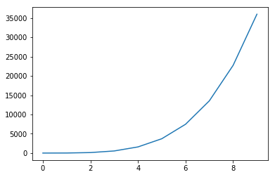

```python
import numpy as np
from matplotlib import pyplot as plt

def PolyCoefficients(x, coeffs):
    """ Returns a polynomial for ``x`` values for the ``coeffs`` provided.

    The coefficients must be in ascending order (``x**0`` to ``x**o``).
    """
    o = len(coeffs)
    print(f'# This is a polynomial of order {ord}.')
    y = 0
    for i in range(o):
        y += coeffs[i]*x**i
    return y

x = np.linspace(0, 9, 10)
coeffs = [1, 2, 3, 4, 5]
plt.plot(x, PolyCoefficients(x, coeffs))
plt.show()
```

    # This is a polynomial of order <built-in function ord>.
    





```python

```
